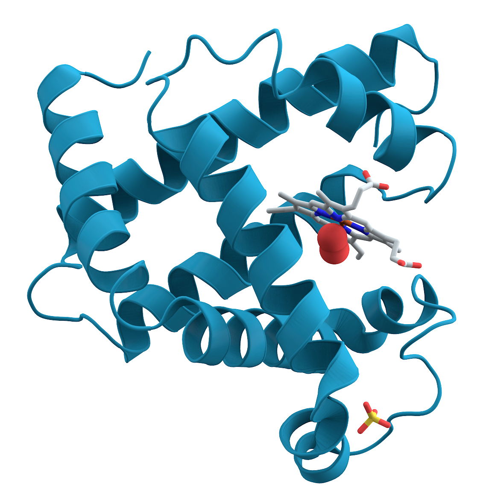

# ¿Qué son las proteínas y qué hacen en el cuerpo?

Las proteínas son uno de los nutrientes esenciales que nuestro cuerpo necesita para funcionar correctamente. Están formadas por pequeñas unidades llamadas **aminoácidos**, que actúan como piezas de construcción para diferentes tejidos y sustancias del organismo.

## ¿Para qué sirven?

Aunque suelen asociarse principalmente con los músculos, las proteínas cumplen muchas otras funciones importantes:

- Ayudan a construir, mantener y reparar los músculos.
- Participan en la formación de la piel, el cabello y las uñas.
- Permiten producir enzimas y algunas hormonas.
- Contribuyen al funcionamiento del sistema inmunitario.
- Ayudan a transportar distintas sustancias por el cuerpo.
- Pueden utilizarse como fuente de energía cuando es necesario.

## ¿Dónde se encuentran?

Podemos obtener proteínas tanto de alimentos de origen animal como vegetal. Algunos ejemplos son:

- Huevos y productos lácteos.
- Legumbres, como lentejas, porotos y garbanzos.
- Soya y alimentos derivados, como tofu y tempeh.
- Frutos secos y semillas.
- Carnes y pescados.

Cada fuente aporta una combinación diferente de aminoácidos. Por eso, mantener una alimentación variada ayuda a obtener todos los que el cuerpo necesita.

## En resumen

Las proteínas no son importantes solamente para quienes entrenan o quieren desarrollar musculatura. Son fundamentales para todas las personas, ya que participan en el crecimiento, la reparación de tejidos y numerosos procesos que mantienen al organismo funcionando correctamente.
